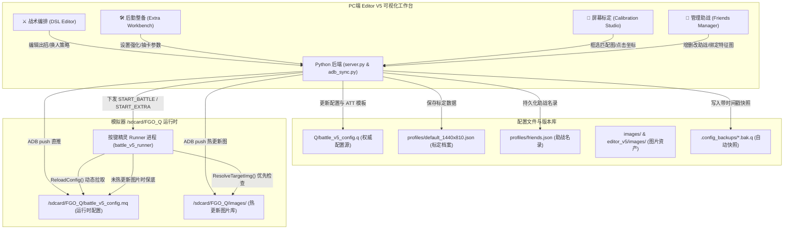
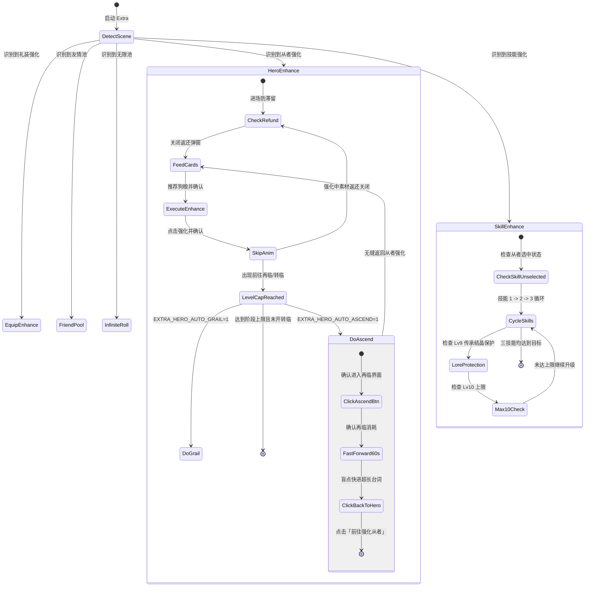
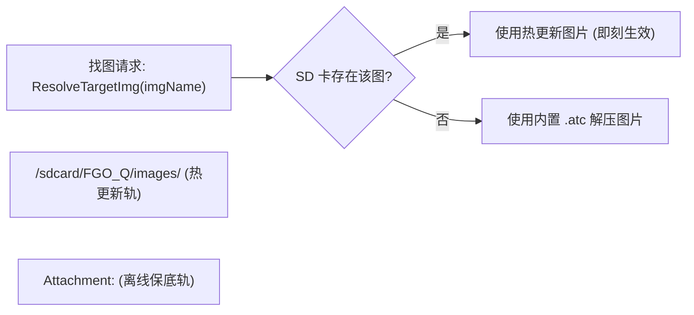

# Runner 与配置文件权威指南 (v5 版本架构规范)

本文档是 FGO_Q 自动化系统 **v5 架构（全视觉解耦、全链路闭环与标定工坊）** 的官方权威指南。全面涵盖 [Q/battle_v5_runner.q](file:///f:/2nd%20Accra/Git/Github/FGO_Q/Q/battle_v5_runner.q)（执行引擎主脚本）、[Q/battle_v5_config.q](file:///f:/2nd%20Accra/Git/Github/FGO_Q/Q/battle_v5_config.q)（战斗策略、助战模板与视觉标定配置库）、[editor_v5/](file:///f:/2nd%20Accra/Git/Github/FGO_Q/editor_v5)（四维可视化编排工作台）、以及 [.atc 附件包与资源部署体系](file:///f:/2nd%20Accra/Git/Github/FGO_Q/.agents/skills/fgo-atc-packager/SKILL.md) 的系统设计、通信协议、坐标规范与闭环控制机制。

前端视觉与交互设计规范请参阅 [🎨 Editor V5 视觉与交互设计规范 (Mooncell Design System)](file:///f:/2nd%20Accra/Git/Github/FGO_Q/docs/editor_ui_design_spec.md)。

---

## 1. 架构演进哲学：从 V4 到 V5 的四维彻底解耦

### 1.1 V4 的遗留瓶颈
在 **V4 架构** 中，初步实现了“出招 DSL 与执行引擎解耦”。但在日常深度使用、多分辨率适配与维护中暴露出明显的瓶颈：
1. **坐标与搜图范围硬编码**：找图范围 `[x1, y1, x2, y2]` 和点击坐标 `[x, y]` 硬编码在 Runner 脚本内部，调整任何坐标都需要反编译或重新打包按键精灵脚本。
2. **静态附件包依赖**：图片匹配过度依赖 PC 按键精灵助手打包的内置 Attachment 资源包，游戏图标若有微调需繁琐重新打包并部署。
3. **助战从者模板耦合**：新增助战或特定阵营从者（如善阵营杀狐、狂呆）需直接修改 Runner 内的多重 `If-Else` 判断分支。
4. **单核战斗思维**：整备（从者强化、灵基再临、技能强化、友情池、无限池）缺乏自动化闭环，必须依靠人工反复在各个界面之间切换。

### 1.2 V5 的四维核心解耦原则
**“策略归 Config，坐标归 Config，助战归 Profile，资源热覆盖，Runner 纯逻辑。”**

- **纯逻辑执行引擎 (Runner)**：不包含任何业务私有硬编码假定。启动时动态拉取最新配置，成为纯粹的状态机与驱动器。
- **全目标配置库 (Config)**：统一管理战斗 DSL、助战模板列表、视觉识别区域与点击坐标点。
- **动态名录档案 (Profile)**：助战名录由 [editor_v5/profiles/friends.json](file:///f:/2nd%20Accra/Git/Github/FGO_Q/editor_v5/profiles/friends.json) 驱动，标定档案由 [editor_v5/profiles/default_1440x810.json](file:///f:/2nd%20Accra/Git/Github/FGO_Q/editor_v5/profiles/default_1440x810.json) 维护，与代码解耦。
- **双轨资源覆盖机制 (Assets)**：模拟器优先命中 `/sdcard/FGO_Q/images/` 动态热更新图库，离线由按键精灵内置 `.atc` 附件包保底。
- **双核分体运行控制 (Twin Run)**：支持 `START_BATTLE`（战术战斗）与 `START_EXTRA`（后勤整备）双核驱动，各自具备独立的调度引擎与安全保护。

---

## 2. 现代协同架构全景图



---

## 3. 目标与坐标配置项规范 (`battle_v5_config.q`)

基准设计分辨率为 **1440 × 810**（16:9 横屏）。全部配置在 [Q/battle_v5_config.q](file:///f:/2nd%20Accra/Git/Github/FGO_Q/Q/battle_v5_config.q) 中以按键精灵标准语法声明：

### 3.1 运行模式与全局参数
| 变量名 | 默认值 | 作用说明 |
| :--- | :--- | :--- |
| `SCREEN_BASE_W` | `1440` | 基准设计宽度 |
| `SCREEN_BASE_H` | `810` | 基准设计高度 |
| `RUN_MODE` | `0` | 当前运行主模式：`0` = 战术战斗 (Battle)，`1` = 后勤整备 (Extra) |
| `ACTION_GROUP_INDEX` | `2` | 当前生效大组：`0`=test, `1`=campaign, `2`=caber, `3`=grand, `4`=ordeal |
| `BATTLE_COUNT` | `30` | 连续战斗次数上限 |
| `APPLE_ENABLE` | `0` | 是否吃苹果补充体力 (`0`=关, `1`=开) |
| `MANUAL_CHOOSE_FRIEND` | `0` | 是否人工选择助战 (`0`=自动找图, `1`=人工选择) |
| `FORCE_COLOR_CARD` | `0` | 是否强制选择策略指定色卡 (`0`=关, `1`=开) |

### 3.2 助战模板声明与准备进战
所有助战从者模板在 `battle_v5_config.q` 中通过 `ATT_<Key>` 统一声明（支持以 `|` 组合多个立绘特征图），由 [editor_v5/profiles/friends.json](file:///f:/2nd%20Accra/Git/Github/FGO_Q/editor_v5/profiles/friends.json) 自动同步：

```vbscript
' ==================== 助战特征匹配图模板 (FRIEND TEMPLATES) ====================
Dim ATT_Aobao = "Attachment:friendAobao1.png|Attachment:friendAobao2.png|Attachment:friendAobao3.png|Attachment:friendAobao5.png"
Dim ATT_Aobaoshan = "Attachment:friendAobao3Shan.png"
Dim ATT_Cdai = "Attachment:friendCDai.png|Attachment:friendCDai2.png|Attachment:friendCDai3.png"
Dim ATT_Daoman = "Attachment:friendDaoMan3.png"
Dim ATT_Cba = "Attachment:friendCba.png"
Dim ATT_Rba = "Attachment:friendRba1.png|Attachment:friendRba2.png|Attachment:friendRba3.png|Attachment:friendRba4.png"
Dim ATT_Rbashan = "Attachment:friendRba3Shan.png"
Dim ATT_Shahu = "Attachment:friendShaHu1.png|Attachment:friendShaHu2.png|Attachment:friendShaHu3.png"
Dim ATT_Shahushan = "Attachment:friendShaHuShan1.png|Attachment:friendShaHuShan2.png|Attachment:friendShaHuShan3.png"
Dim ATT_Princess = "Attachment:friendPrincess.png|Attachment:friendPrincess2.png|Attachment:friendPrincess3.png"
Dim ATT_Princess120 = "Attachment:friendPrincess120.png|Attachment:friendPrincess1202.png|Attachment:friendPrincess1203.png"
Dim ATT_Taigong = "Attachment:friendtaigong.png"
Dim ATT_Sparrow = "Attachment:friendSparrow.png"
Dim ATT_Mary = "Attachment:friendMary1.png|Attachment:friendMary2.png"
Dim ATT_Keli = "Attachment:friendKeli1.png|Attachment:friendKeli2.png|Attachment:friendKeli3.png"
```

| 变量名 | 默认值 / 格式 | 含义 |
| :--- | :--- | :--- |
| `PREPARE_FRIEND_AREA` | `Array(40, 180, 920, 800)` | 助战职阶列表滚动检索识别区域 |
| `PREPARE_FRIEND_EQUIP_TAR` | `Array(40, 180, 920, 800, "Attachment:friend_equip_goodness.png")` | 助战概念礼装检索目标 |
| `START_TAR` | `Array(1200, 700, 1420, 800, "Attachment:START_BTN.png")` | 编队确认页“开始战斗”按钮 |
| `START_TAPED_DELAY` | `8000` | 点击开始按钮后的等待加载延迟 (ms) |

### 3.3 战斗操作坐标（从者技能、指向、换人、御主）
| 变量名 | 默认值 | 对应按键 / 作用 |
| :--- | :--- | :--- |
| `BATTLE_HERO_SKILL_CHECK_TAR` | `Array(1200, 700, 1350, 750, "Attachment:ATTACK_BTN.png")` | 主攻击键识别（判定行动就绪） |
| `TAP_HERO_SKILL_1_1` ~ `1_3` | `[84, 650]`, `[183, 650]`, `[282, 650]` | 1 号位从者第 1、2、3 技能 |
| `TAP_HERO_SKILL_2_1` ~ `2_3` | `[441, 650]`, `[540, 650]`, `[639, 650]` | 2 号位从者第 1、2、3 技能 |
| `TAP_HERO_SKILL_3_1` ~ `3_3` | `[799, 650]`, `[897, 650]`, `[996, 650]` | 3 号位从者第 1、2、3 技能 |
| `BATTLE_SKILL_GRANT_CHECK_TAR` | `Array(1205, 142, 1267, 198, "Attachment:BATTLE_SKILL_GRANT_CHECK.png")` | 技能指向选择界面弹窗识别 |
| `TAP_SKILL_GRANT_HERO_1` ~ `3` | `[360, 500]`, `[717, 500]`, `[1074, 500]` | 指向充能选择 1、2、3 号从者 |
| `BATTLE_SKILL_CHANGE_CHECK_TAR` | `Array(723, 685, 777, 719, ...)` | 换人界面弹窗确认按钮检测 |
| `BATTLE_SKILL_CHANGE_SELECTEED_CHECK_TAR` | `Array(723, 685, 777, 719, ...)` | 换人从者选中后确认键高亮检测 |
| `TAP_SKILL_CHANGE_FRONT_1` ~ `3` | `[150, 390]`, `[375, 390]`, `[600, 390]` | 换人前排 1、2、3 号位从者 |
| `TAP_SKILL_CHANGE_BACK_1` ~ `3` | `[825, 390]`, `[1050, 390]`, `[1275, 390]` | 换人后排 1、2、3 号位从者 |
| `BATTLE_MASTER_SKILL_OPEN_TAR` | `Array(1280, 300, 1410, 420, ...)` | 御主技能展开图标识别 |
| `TAP_MASTER_SKILL_OPEN` | `Array(1317, 325)` | 御主技能抽屉展开点击点 |
| `TAP_MASTER_SKILL_1` ~ `3` | `[1020, 350]`, `[1120, 350]`, `[1220, 350]` | 御主第 1、2、3 技能点击点 |
| `BATTLE_SKILL_SPEEDUP_COORD` | `Array(1100, 770)` | 技能释放后的画面加速防卡点击点 |
| `BATTLE_SKILL_SPECIAL_SKILL_A_TAR` | `Array(180, 240, 345, 410, ...)` | 特殊技能弹窗检测（如静希草十郎） |
| `TAP_SKILL_SPECIAL_SKILL_A_ACT_3` | `Array(1060, 480)` | 特殊技能第 3 动作选项点击坐标 |

### 3.4 敌方选怪、卡牌选出与卡牌确认
| 变量名 | 默认值 | 作用说明 |
| :--- | :--- | :--- |
| `TAP_TARGET_ENEMY_1` ~ `6` | `[159, 33]`, `[424, 33]`, `[689, 33]` 等 | 敌方 6 个目标位置点击点 (前排 1~3、后排 4~6) |
| `BATTLE_ATTACK_BACK_TAR` | `Array(1300, 750, 1390, 785, ...)` | 选卡界面中的返回键识别 |
| `TAP_CARD_NORMAL_1` ~ `5` | `[118, 581]` 至 `[1278, 581]` | 指令卡 1~5 号位点击点 |
| `TAP_CARD_NP_1` ~ `3` | `[412, 322]`, `[699, 322]`, `[986, 322]` | 宝具卡 1~3 号位点击点 |
| `BATTLE_ATTACK_CARD_BUSTER_TAR` | `Array(55, 460, 1390, 690, ...)` | Buster 红卡区域识别范围 |
| `BATTLE_ATTACK_CARD_ARTS_TAR` | `Array(55, 460, 1390, 690, ...)` | Arts 蓝卡区域识别范围 |
| `BATTLE_ATTACK_CARD_QUICK_TAR` | `Array(55, 460, 1390, 690, ...)` | Quick 绿卡区域识别范围 |
| `BATTLE_ATTACK_CARD_6_FIRST_TAPED_TAR` ~ `8` | 见配置 | 宝具 1~3 选出后高亮判定（红/蓝/绿三色多候选） |
| `BATTLE_ATTACK_CARD_3_FIRST_TAPED_TAR` | 见配置 | 普卡首位选出后的高亮识别区域 |

### 3.5 结算、吃苹果与连续再战
| 变量名 | 默认值 | 作用说明 |
| :--- | :--- | :--- |
| `AWARD_TIE_TAR` | `Array(90, 190, 330, 225, ...)` | 战后羁绊/结果标识检测 |
| `AWARD_TIE_UP_TAR` | `Array(696, 101, 828, 245, ...)` | 从者羁绊等级提升升级弹窗检测 |
| `TAP_AWARD_SKIP` | `Array(166, 60)` | 战后连续点击跳过动画空白坐标 |
| `AWARD_TREASURE_NEXT_TAR` | `Array(1178, 696, 1282, 740, ...)` | 战利品掉落“下一步”按钮 |
| `AWARD_ACTIVITY_NEXT_TAR` | `Array(1178, 696, 1282, 740, ...)` | 活动点数结算“下一步”按钮 |
| `ADD_FRIEND_TAR` | `Array(325, 670, 415, 715, ...)` | 好友申请弹窗“拒绝/关闭”按钮 |
| `AGAIN_ALERT_AGAIN_TAR` | `Array(795, 620, 1030, 700, ...)` | 连续出击“连续出击”按钮 |
| `AGAIN_ALERT_CLOSE_TAR` | `Array(370, 620, 620, 700, ...)` | 连续出击“关闭”按钮 |
| `AGAIN_ORDEAL_NO_TICKET_TAR` | `Array(600, 600, 850, 670, ...)` | 白纸化地球茶壶/体力耗尽提示 |
| `AGAIN_BATTLE_OUT_MENU_TAR` | `Array(1301, 689, 1360, 715, ...)` | 关卡选择退出菜单标识 |
| `APPLE_DISPLAY_TAR` | `Array(634, 37, 743, 83, ...)` | 体力耗尽恢复确认弹窗 |
| `APPLE_CONFIRM_TAR` | `Array(895, 608, 992, 660, ...)` | 吃苹果使用确认按钮 |
| `TAP_APPLE_GOLDEN` | `Array(420, 360)` | 金苹果选项点击点 |
| `TAP_APPLE_SILVER` | `Array(420, 520)` | 银苹果选项点击点 |
| `TAP_APPLE_CLOSE` | `Array(720, 695)` | 吃苹果弹窗取消关闭按钮 |

### 3.6 后勤整备 (Extra) 参数与全目标配置
| 变量名 | 默认值 / 格式 | 作用说明 |
| :--- | :--- | :--- |
| `EXTRA_ACTION_COUNT` | `30` | Extra 动作执行上限次数 (1~999，如强化 30 次/抽卡 100 次) |
| `EXTRA_SKILL_MAX_LEVEL` | `10` | 技能强化目标上限等级 (1~10，若小于 10 则防止升 10 消耗结晶) |
| `EXTRA_SKILL_AUTO_THREE` | `1` | 技能强化是否自动轮询 1、2、3 全部技能 (`0`=关, `1`=开) |
| `EXTRA_HERO_AUTO_ASCEND` | `1` | 从者强化是否在满级时自动执行灵基再临 (`0`=关, `1`=开) |
| `EXTRA_HERO_AUTO_GRAIL` | `0` | 从者强化是否在满级时自动执行圣杯转临 (`0`=关, `1`=开，默认防误耗) |
| `ENHANCE_HERO_TAR` | `Array(880, 5, 1300, 70, ...)` | 从者强化主界面标识 |
| `ENHANCE_HERO_RECOMMAND_TAR` | `Array(1240, 150, 1370, 208, ...)` | 自动选择推荐狗粮按钮 |
| `ENHANCE_HERO_RECOMMAND_CONFIRM_TAR`| `Array(880, 680, 1006, 745, ...)` | 自动推荐狗粮弹窗“决定/确认”按钮 |
| `ENHANCE_HERO_ENHANCE_TAR` | `Array(1340, 716, 1438, 798, ...)` | 从者/再临执行强化主按钮 |
| `ENHANCE_HERO_ENHANCE_CONFIRM_TAR` | `Array(877, 632, 1006, 698, ...)` | 从者强化弹窗确认按钮 |
| `ENHANCE_HERO_REFUND_CLOSE_TAR` | `Array(550, 580, 890, 680, ...)` | 溢出经验/素材返还弹窗“关闭”按钮 |
| `TAP_ENHANCE_HERO_REFUND_CLOSE` | `Array(686, 614)` | 经验/素材返还弹窗点击点 |
| `ENHANCE_HERO_TO_ASCEND_TAR` | `Array(1050, 580, 1320, 680, ...)` | 满级时“前往灵基再临”跳转按钮识别 |
| `TAP_ENHANCE_HERO_TO_ASCEND` | `Array(1185, 628)` | 点击前往灵基再临跳转点 |
| `ENHANCE_HERO_TO_GRAIL_TAR` | `Array(1050, 580, 1320, 680, ...)` | 满级时“前往圣杯转临”跳转按钮识别 |
| `TAP_ENHANCE_HERO_TO_GRAIL` | `Array(1185, 628)` | 点击前往圣杯转临跳转点 |
| `ENHANCE_ASCEND_TAR` | `Array(880, 5, 1300, 70, ...)` | 灵基再临主界面标识 |
| `ENHANCE_ASCEND_BTN_TAR` | `Array(1340, 716, 1438, 798, ...)` | 灵基再临执行按钮 |
| `ENHANCE_ASCEND_CONFIRM_TAR` | `Array(877, 632, 1006, 698, ...)` | 灵基再临弹窗确认按钮 |
| `ENHANCE_ASCEND_TO_HERO_TAR` | `Array(1000, 270, 1360, 370, ...)` | 再临完成后“前往强化从者”快捷返回按钮 |
| `TAP_ENHANCE_ASCEND_TO_HERO` | `Array(1180, 321)` | 点击“前往强化从者”快捷跳转点 |
| `ENHANCE_ASCEND_BACK_TAR` | `Array(40, 10, 120, 65, ...)` | 灵基再临左上角返回按钮 |
| `TAP_ENHANCE_ASCEND_BACK` | `Array(60, 40)` | 左上角返回点击点 |
| `ENHANCE_GRAIL_TAR` | `Array(1050, 5, 1420, 70, ...)` | 圣杯转临主界面标识 |
| `ENHANCE_GRAIL_CONFIRM_TAR` | `Array(877, 632, 1006, 698, ...)` | 圣杯转临弹窗确认按钮 |
| `TAP_ENHANCE_GRAIL_CONFIRM` | `Array(943, 662)` | 圣杯转临弹窗确认点击点 |
| `TAP_ENHANCE_BLIND_SKIP` | `Array(940, 660)` | 强化/再临结算超长立绘与语音盲点快进点击点 |
| `ENHANCE_SKILL_TAR` | `Array(880, 5, 1300, 70, ...)` | 技能强化主界面标识 |
| `ENHANCE_SKILL_ENHANCE_TAR` | `Array(1185, 725, 1230, 785, ...)` | 技能强化主按钮 |
| `ENHANCE_SKILL_ENHANCE_CONFIRM_TAR`| `Array(820, 640, 890, 690, ...)` | 技能强化弹窗确认按钮 |
| `ENHANCE_SKILL_ENHANCE_L10_TAR` | `Array(450, 490, 610, 630, ...)` | 技能升 10 级专用标识 (传承结晶提示) |
| `ENHANCE_SKILL_MAX_L10_TAR` | `Array(1150, 720, 1410, 800, ...)` | 技能已达 Lv10 上限标识 |
| `ENHANCE_SKILL_CLICK_COORD` | `Array(1100, 765)` | 技能升级动画快速点击跳过点 |
| `TAP_ENHANCE_SKILL_1` ~ `3` | `[532, 286]`, `[852, 286]`, `[1172, 286]` | 技能强化界面 1、2、3 号技能切换点击点 |
| `ENHANCE_SKILL_HERO_UNSELECTED_TAR`| `Array(140, 560, 300, 630, ...)` | 从者未选择或技能满级自动取消选中标识 |
| `ENHANCE_EQUIP_TAR` | `Array(880, 5, 1300, 70, ...)` | 概念礼装强化主界面标识 |
| `ENHANCE_EQUIP_ENHANCE_TAR` | `Array(1340, 716, 1438, 798, ...)` | 礼装强化主按钮 |
| `ENHANCE_EQUIP_ENHANCE_CONFIRM_TAR`| `Array(877, 632, 1006, 698, ...)` | 礼装强化弹窗确认按钮 |
| `POOLFRIEND_CONTINUE_TAR` | `Array(720, 720, 990, 800, ...)` | 友情点召唤继续抽卡按钮 |
| `POOLFRIEND_GO_TAR` | `Array(830, 600, 1080, 670, ...)` | 友情池前往召唤确认按钮 |
| `INFINITE_ROLL_TAR` | `Array(330, 370, 620, 610, ...)` | 无限池抽奖按钮 (ROLL100 / ROLL10) |
| `INFINITE_ROLL_FAST_COORD` | `Array(300, 400)` | 无限池极速连点空白点 |

---

## 4. 后勤整备 (Extra) 自动化闭环引擎规范

在 [Q/battle_v5_runner.q](file:///f:/2nd%20Accra/Git/Github/FGO_Q/Q/battle_v5_runner.q) 中，Extra 模式已进化为包含自检、跳转、动画跳过与返回自循环的完整闭环。



### 4.1 从者强化与灵基再临自闭环 (`DoEnhance` & `DoHeroAscendFlow`)
1. **防滞留检测**：进入每轮强化前，首先识别 `ENHANCE_HERO_REFUND_CLOSE_TAR`，即时关闭由于大成功导致经验溢出弹出的素材返还弹窗。
2. **自动喂狗粮**：点击 `ENHANCE_HERO_RECOMMAND_TAR` 触发系统推荐狗粮，并在弹出确认窗口后点击 `ENHANCE_HERO_RECOMMAND_CONFIRM_TAR`。
3. **强化执行与立绘跳过**：点击 `ENHANCE_HERO_ENHANCE_TAR` 与 `ENHANCE_HERO_ENHANCE_CONFIRM_TAR`，随后调用 `SkipHeroEnhanceAnim()` 持续以 `TAP_ENHANCE_BLIND_SKIP` 快进动画。
4. **无缝灵基再临**：
   - 强化达到当前等级上限时，游戏右下角浮现“前往灵基再临”（`ENHANCE_HERO_TO_ASCEND_TAR`）。
   - 若 `EXTRA_HERO_AUTO_ASCEND = 1`，Runner 自动点击跳转，进入灵基再临界面。
   - 点击灵基再临主按钮并确认后，启动最长 **60 秒的安全盲点快进**，跳过从者的长篇晋级台词与立绘演出。
   - 检测到界面右上角的「前往强化从者」按钮（`ENHANCE_ASCEND_TO_HERO_TAR`）时，立即点击返回从者强化界面，**形成无缝自循环**，继续喂食下一阶段狗粮！
5. **圣杯转临守护 (`DoHeroGrailFlow`)**：
   - 当从者达到 4 破满级，界面浮现“前往圣杯转临”（`ENHANCE_HERO_TO_GRAIL_TAR`）。
   - 系统将 `EXTRA_HERO_AUTO_GRAIL` 默认设为 `0` 作为安全红线。仅在用户明确启用时才会进入圣杯转临流程，并在转临完成后同样借助「前往强化从者」返回原界面。

### 4.2 技能三技能轮询与结晶防护 (`DoSkillEnhance`)
1. **三技能自动轮询**：若 `EXTRA_SKILL_AUTO_THREE = 1`，引擎从技能 1 开始强化，升至目标或材料不足后，自动依次切换至技能 2（`TAP_ENHANCE_SKILL_2`）和技能 3（`TAP_ENHANCE_SKILL_3`）。
2. **传承结晶安全锁**：若 `EXTRA_SKILL_MAX_LEVEL < 10`（默认预设为 9），当检测到技能进入升 10 级弹窗并出现传承结晶图标（`ENHANCE_SKILL_ENHANCE_L10_TAR`）时，系统立即中断当前技能升级，防止意外消耗珍贵结晶。
3. **满级自动完结**：当技能达到 10 级（`ENHANCE_SKILL_MAX_L10_TAR`）或所有技能升满导致从者自动取消选中（`ENHANCE_SKILL_HERO_UNSELECTED_TAR`）时，引擎安全退出。

---

## 5. 助战管理体系与动态模板寻址规范

在 V5 架构中，助战体系完全解耦为独立的名录档案与动态寻址管线：

### 5.1 助战名录档案 (`editor_v5/profiles/friends.json`)
助战从者信息由 [profiles/friends.json](file:///f:/2nd%20Accra/Git/Github/FGO_Q/editor_v5/profiles/friends.json) 集中持久化：
```json
{
  "version": "1.0",
  "friends": [
    {
      "key": "shahu",
      "name": "杀狐",
      "shortLabel": "杀狐",
      "builtin": true,
      "images": [
        "friendShaHu1.png",
        "friendShaHu2.png",
        "friendShaHu3.png"
      ],
      "description": "红卡核心拐"
    },
    {
      "key": "shahushan",
      "name": "杀狐+善",
      "shortLabel": "杀狐+善",
      "builtin": true,
      "images": [
        "friendShaHuShan1.png",
        "friendShaHuShan2.png",
        "friendShaHuShan3.png"
      ],
      "description": "善阵营杀狐"
    }
  ]
}
```

### 5.2 动态模板同步与 Runner 零侵入解析
1. **Config 自动生成声明**：Editor V5 后端保存配置时，自动遍历 `friends.json`，在 `battle_v5_config.q` 头部生成对应的 `Dim ATT_<FriendKey> = "Attachment:img1.png|..."` 语句。
2. **Runner 动态反射检索**：
   在 [Q/battle_v5_runner.q](file:///f:/2nd%20Accra/Git/Github/FGO_Q/Q/battle_v5_runner.q) 的 `ReloadConfig()` 中：
   ```vbscript
   Dim customAtt = Trim(CStr(CfgGet("att_" & selectedFriendKey, "")))
   If Len(customAtt) > 0 And customAtt <> "Attachment:" Then
       PREPARE_FRIEND_TAR = Array(PREPARE_FRIEND_AREA[1], PREPARE_FRIEND_AREA[2], PREPARE_FRIEND_AREA[3], PREPARE_FRIEND_AREA[4], customAtt)
       HAS_FRIEND_CONFIG = true
   ...
   ```
   **优势**：在 Editor V5 的「管理助战」面板中新增任意从者并完成标定截图后，**无需修改 `battle_v5_runner.q` 的任何一行代码**，即可在战术编排中直接选择并生效！

---

## 6. 动静态双轨资产与 .atc 附件包规范

按键精灵在安卓端运行时依赖图片资源，系统采用动静态双轨保障：



### 6.1 双轨分工
1. **第一优先级（动态热更新轨 · 免打包）**：
   - 路径：`/sdcard/FGO_Q/images/<fileName>.png`
   - **特点**：在 Editor V5 标定工坊中截图标定、重新裁剪、或新增助战后，点击保存即可通过 ADB 推送至该目录。**脚本无需重编译，不需要重新打包按键精灵工程**。
2. **第二优先级（离线保底轨 · ATC 封装）**：
   - 路径：`Attachment:<fileName>.png`（从按键精灵打包的 `.atc` 中解压提取）
   - **特点**：用于离线发布、换机迁移或首次部署环境的兜底保证。

### 6.2 自动化打包与同步工具 (`manage_atc.py`)
系统提供了自动化命令行工具 [.agents/skills/fgo-atc-packager/scripts/manage_atc.py](file:///f:/2nd%20Accra/Git/Github/FGO_Q/.agents/skills/fgo-atc-packager/scripts/manage_atc.py)，配合专用打包技能实现全自动附件包管理：
- **查看附件包内容**：`python manage_atc.py info <atc_file>`
- **一键打包全量素材**：`python manage_atc.py pack --images-dir images/ --output runner_v5.atc`
- **自动同步到模拟器与 PC 手机助手**：`python manage_atc.py sync-all`

---

## 7. Runner 动态解析与运行时防护机制

### 7.1 字符串转原生数组 (`ParseTarget` / `ParseCoord`)
在 `battle_v5_runner.q` 中，从外部 `.mq` 读取字符串后：
- `ParseTarget(cfgStr, defaultTar)`：支持解析形如 `Array(1200, 700, 1420, 800, "Attachment:START_BTN.png")` 的字符串，自动切分为 `[x1, y1, x2, y2, imgPath]` 5 个元素的原生数组。
- `ParseCoord(cfgStr, defaultCoord)`：支持解析形如 `Array(84, 650)` 的字符串为 `[x, y]` 原生坐标数组。
- **容错保底**：若外部配置缺省、解析错误或缺失，自动回退到默认常量，保证按键精灵脚本在任何异常配置下均不崩溃。

### 7.2 场景智能自愈与环境就绪 (`ready_env`)
- 在下发执行前，Editor V5 会探测模拟器环境：
  - 自动检查按键精灵后台进程是否存活。
  - 支持 `/api/runner/ready_env` 自动拉起按键精灵与 Runner。
  - 支持 `/api/fgo/navigate_home` 自动点击跳过公告弹窗、回归游戏主界面。

---

## 8. Editor V5 工作流与双核运行控制

### 8.1 启动服务
- 运行 `python editor_v5/launcher.py` 或 `python editor_v5/server.py`。
- 服务默认在 `http://127.0.0.1:8099` 启动。内置单实例端口占用检测，若 8099 端口已被占用，自动唤醒前台窗口。

### 8.2 四大顶级工作台 (Quad-View Workbenches)
1. **⚔️ 战术编排 (DSL Editor)**：
   - 树状展示关卡大组与多套出招方案。
   - 支持可视化点击添加从者技能、指向充能、战斗服换人、选敌与出牌。
   - 助战选择下拉框直连助战名录，实时响应新增从者。
2. **🛠️ 后勤整备 (Extra Workbench)**：
   - 汇集从者强化、灵基再临、圣杯转临、技能强化、礼装强化、友情点与无限池控制。
   - 搭载 `/api/extra/detect_scene` **场景智能探测器**：一键截屏比对当前 FGO 所处界面并向用户反馈匹配状态。
   - 提供 10 / 30 / 100 / 999 常用动作次数快速选择筹码，默认锁定技能 9 级结晶防误触。
3. **📐 屏幕标定 (Calibration Studio)**：
   - 实时截取模拟器画面，支持在画布上拖拽框选视觉目标或直接点击拾取中心坐标。
   - 内置 OpenCV 模板匹配测试（`/api/calibrate/test_match`），即时评估搜图置信度。
   - 保存时一键更新 `profiles/default_1440x810.json`、改写 `battle_v5_config.q`、并自动推送到模拟器 `/sdcard/FGO_Q/images/`。
4. **👥 管理助战 (Friends Manager)**：
   - 展示全局助战名录卡片，实时校验每张特征图在磁盘上的物理存在状态。
   - 支持新增自定义助战，自动分配规范特征图名称（如 `friendTiamat1.png`）。
   - 提供直通标定工坊的无缝引导，新增助战一键前往框选并生成特征图。

### 8.3 双核分体运行按钮 (Twin Run Group) 与状态互斥
- 待命状态呈现双拼按钮：`[ ⚔️ 运行战斗 | 🛠️ 运行整备 ]`。
- 启动任意任务后，按钮合并为动态呼吸脉冲的 `[ ⏹ 停止任务 ]`。
- **任务严格互斥**：战斗运行中，整备面板显示黄色防误触警告横幅并禁用触发；反之亦然，且均提供内嵌的紧急停止按钮。

### 8.4 配置持久化与历史快照保护机制
- **标定段完整性保护 (`ensure_targets_in_config`)**：Web 端提交纯战斗 DSL 时，后端自动校验并强制保留底部的视觉目标与标定块，杜绝因保存配置导致标定丢失。
- **自动化快照回退**：每次调用 `/api/save` 或 `/api/sync` 修改配置时，后端在 `.config_backups/` 目录下自动生成带精确时间戳的快照文件（如 `battle_v5_config.20261009_154500.bak.q`），保留最近 10 次历史记录，确保配置随时可溯源回滚。
