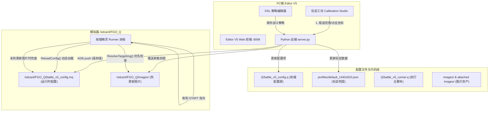

# Runner 与配置文件权威指南 (v5 版本架构规范)

本文档是 FGO_Q 自动化系统 **v5 架构（全视觉解耦与标定工坊）** 的官方权威指南。全面涵盖 `battle_v5_runner.q`（战斗执行引擎）、`battle_v5_config.q`（策略与坐标配置库）、以及 [editor_v5/](file:///f:/2nd%20Accra/Git/Github/FGO_Q/editor_v5)（可视化编排与标定工坊）的系统设计、通信协议、坐标规范与热下发机制。前端视觉与交互规范请参阅 [🎨 Editor V5 视觉与交互设计规范 (Mooncell Design System)](file:///f:/2nd%20Accra/Git/Github/FGO_Q/docs/editor_ui_design_spec.md)。

---

## 1. 架构演进哲学：从 V4 到 V5 的彻底解耦

### 1.1 V4 的遗留痛点
在 **V4 架构** 中，实现了“策略 DSL（出招、换人、吃苹果、选助战）与执行引擎解耦”。然而，当面对不同模拟器分辨率、屏幕比例（如 16:9、18:9、20:9）或游戏界面改版时，依然存在瓶颈：
1. **坐标与范围硬编码在 Runner**：所有的找图范围 `[x1, y1, x2, y2]` 和点击坐标 `[x, y]` 全部硬编码在 `battle_v4_runner.q` 内部，调整坐标必须反编译或修改按键精灵主代码。
2. **匹配图绑定静态资源**：图片资源拘于 PC 助手打包的内置 Attachment，一旦游戏图标发生微调，必须重新截图、打包工程并重新下发。

### 1.2 V5 的核心解耦原则
**“策略归 Config，坐标归 Config，资源热覆盖，Runner 纯逻辑。”**
- **Runner（执行引擎）**：不包含任何业务私有假定，启动时动态读取配置，成为纯粹的状态机与驱动器。
- **Config（配置库）**：不仅包含战斗 DSL，还统一管理全部视觉目标（图片名称、搜图范围）和点击坐标。
- **Editor V5（标定工坊与编辑器）**：提供实时截图标定、拖拽框选、坐标拾取、OpenCV 模板测试，并自动将最新坐标与图片一键推送到模拟器。

---

## 2. 三位一体协同流程

---

## 3. 目标与坐标配置项规范 (`battle_v5_config.q`)

基准分辨率：**1440 × 810**。所有坐标均在 `Q/battle_v5_config.q` 的尾部以标准 按键精灵 语法定义：

### 3.1 基础参数
| 变量名 | 默认值 | 作用说明 |
| :--- | :--- | :--- |
| `SCREEN_BASE_W` | `1440` | 基准设计宽度 |
| `SCREEN_BASE_H` | `810` | 基准设计高度 |

### 3.2 准备与进战
| 变量名 | 格式 | 含义 |
| :--- | :--- | :--- |
| `PREPARE_FRIEND_AREA` | `Array(40, 180, 920, 800)` | 助战好友列表识别滚屏检索区域 |
| `PREPARE_FRIEND_EQUIP_TAR` | `Array(40, 180, 920, 800, "Attachment:friend_equip_goodness.png")` | 助战礼装匹配目标 |
| `START_TAR` | `Array(1200, 700, 1420, 800, "Attachment:START_BTN.png")` | 编队确认页“开始战斗”按钮 |
| `START_TAPED_DELAY` | `8000` | 点击开始按钮后的等待加载延迟 (ms) |

### 3.3 战斗操作坐标（从者技能、指向、换人、御主）
| 变量名 | 默认值 | 对应按键 / 作用 |
| :--- | :--- | :--- |
| `BATTLE_HERO_SKILL_CHECK_TAR` | `Array(1200, 700, 1350, 750, "Attachment:ATTACK_BTN.png")` | 主攻击键识别（判断行动就绪） |
| `TAP_HERO_SKILL_1_1` ~ `1_3` | `[84, 650]`, `[183, 650]`, `[282, 650]` | 1号位从者的第 1、2、3 技能 |
| `TAP_HERO_SKILL_2_1` ~ `2_3` | `[441, 650]`, `[540, 650]`, `[639, 650]` | 2号位从者的第 1、2、3 技能 |
| `TAP_HERO_SKILL_3_1` ~ `3_3` | `[799, 650]`, `[897, 650]`, `[996, 650]` | 3号位从者的第 1、2、3 技能 |
| `BATTLE_SKILL_GRANT_CHECK_TAR` | `Array(1205, 142, 1267, 198, "Attachment:BATTLE_SKILL_GRANT_CHECK.png")` | 技能指向选择界面弹窗检测 |
| `TAP_SKILL_GRANT_HERO_1` ~ `3` | `[360, 500]`, `[717, 500]`, `[1074, 500]` | 指向充能选择 1、2、3 号从者 |
| `BATTLE_SKILL_CHANGE_CHECK_TAR` | `Array(723, 685, 777, 719, ...)` | 换人界面弹窗确认 |
| `TAP_SKILL_CHANGE_FRONT_1` ~ `3` | `[150, 390]`, `[375, 390]`, `[600, 390]` | 换人前排 1、2、3 号位从者 |
| `TAP_SKILL_CHANGE_BACK_1` ~ `3` | `[825, 390]`, `[1050, 390]`, `[1275, 390]` | 换人后排 1、2、3 号位从者 |
| `BATTLE_MASTER_SKILL_OPEN_TAR` | `Array(1280, 300, 1410, 420, ...)` | 御主技能展开图标识别 |
| `TAP_MASTER_SKILL_OPEN` | `Array(1317, 325)` | 御主技能抽屉展开点击点 |
| `TAP_MASTER_SKILL_1` ~ `3` | `[1020, 350]`, `[1120, 350]`, `[1220, 350]` | 御主第 1、2、3 技能点击点 |
| `BATTLE_SKILL_SPEEDUP_COORD` | `Array(1100, 770)` | 技能释放后的画面加速防卡点击点 |

### 3.4 敌方选怪与卡牌选出
| 变量名 | 默认值 | 作用说明 |
| :--- | :--- | :--- |
| `TAP_TARGET_ENEMY_1` ~ `6` | 见配置 | 敌方 6 个目标位置点击点 (前排1~3、后排4~6) |
| `BATTLE_ATTACK_BACK_TAR` | `Array(1300, 750, 1390, 785, ...)` | 选卡界面中的返回键识别 |
| `TAP_CARD_NORMAL_1` ~ `5` | `[118, 581]` 至 `[1278, 581]` | 指令卡 1~5 号位点击点 |
| `TAP_CARD_NP_1` ~ `3` | `[412, 322]`, `[699, 322]`, `[986, 322]` | 宝具卡 1~3 号位点击点 |
| `BATTLE_ATTACK_CARD_BUSTER_TAR` | `Array(55, 460, 1390, 690, ...)` | Buster 红卡区域识别范围 |
| `BATTLE_ATTACK_CARD_ARTS_TAR` | `Array(55, 460, 1390, 690, ...)` | Arts 蓝卡区域识别范围 |
| `BATTLE_ATTACK_CARD_QUICK_TAR` | `Array(55, 460, 1390, 690, ...)` | Quick 绿卡区域识别范围 |

### 3.5 结算、吃苹果与再战
| 变量名 | 默认值 | 作用说明 |
| :--- | :--- | :--- |
| `AWARD_TIE_TAR` | `Array(90, 190, 330, 225, ...)` | 战后羁绊/结果标识检测 |
| `TAP_AWARD_SKIP` | `Array(166, 60)` | 战后连续点击跳过动画空白坐标 |
| `AWARD_TREASURE_NEXT_TAR` | `Array(1178, 696, 1282, 740, ...)` | 战利品掉落“下一步”按钮 |
| `ADD_FRIEND_TAR` | `Array(325, 670, 415, 715, ...)` | 好友申请弹窗“拒绝/关闭”按钮 |
| `AGAIN_ALERT_AGAIN_TAR` | `Array(795, 620, 1030, 700, ...)` | 连续出击“连续出击”按钮 |
| `AGAIN_ALERT_CLOSE_TAR` | `Array(370, 620, 620, 700, ...)` | 连续出击“关闭”按钮 |
| `APPLE_DISPLAY_TAR` | `Array(634, 37, 743, 83, ...)` | 体力耗尽恢复确认弹窗 |
| `TAP_APPLE_GOLDEN` | `Array(420, 360)` | 金苹果选项点击点 |
| `TAP_APPLE_SILVER` | `Array(420, 520)` | 银苹果选项点击点 |
| TAP_APPLE_CLOSE | Array(720, 695) | 吃苹果弹窗取消关闭按钮 |

### 3.6 整备 (Extra) 参数与目标配置
| 变量名 | 默认值 / 格式 | 作用说明 |
| :--- | :--- | :--- |
| `RUN_MODE` | `0` | 运行模式：0=战术战斗模式，1=整备(Extra)模式 |
| `EXTRA_ENABLE` | `true` | 是否启用整备功能支持 |
| `EXTRA_ACTION_COUNT` | `30` | Extra 动作执行上限次数 (1~999，如强化30次/抽卡100次) |
| `EXTRA_SKILL_MAX_LEVEL` | `9` | 技能强化上限等级 (1~10，默认9防误升10消耗结晶) |
| `INFINITE_ROLL_TAR` | `Array(740, 520, 890, 580, ...)` | 无限池抽奖按钮匹配区域 |
| `INFINITE_ROLL_FAST_COORD` | `Array(600, 400)` | 无限池极速连点空白点 |
| `ENHANCE_HERO_TAR` | `Array(100, 100, 300, 300, ...)` | 从者强化页面标识 |
| `ENHANCE_HERO_ENHANCE_TAR` | `Array(1200, 720, 1370, 785, ...)` | 从者强化主按钮 |
| `ENHANCE_HERO_ENHANCE_CONFIRM_TAR` | `Array(800, 600, 1020, 680, ...)` | 从者强化确认弹窗按钮 |
| `ENHANCE_HERO_RECOMMAND_TAR` | `Array(1150, 240, 1260, 300, ...)` | 自动选择推荐狗粮按钮 |
| `ENHANCE_EQUIP_TAR` | `Array(100, 100, 300, 300, ...)` | 概念礼装强化页面标识 |
| `ENHANCE_EQUIP_ENHANCE_TAR` | `Array(1200, 720, 1370, 785, ...)` | 礼装强化主按钮 |
| `ENHANCE_EQUIP_ENHANCE_CONFIRM_TAR` | `Array(800, 600, 1020, 680, ...)` | 礼装强化确认弹窗按钮 |
| `ENHANCE_SKILL_TAR` | `Array(100, 100, 300, 300, ...)` | 技能强化页面标识 |
| `ENHANCE_SKILL_ENHANCE_TAR` | `Array(1200, 720, 1370, 785, ...)` | 技能强化主按钮 |
| `ENHANCE_SKILL_ENHANCE_CONFIRM_TAR` | `Array(800, 600, 1020, 680, ...)` | 技能强化确认弹窗按钮 |
| `ENHANCE_SKILL_ENHANCE_L10_TAR` | `Array(780, 200, 870, 245, ...)` | 技能升 10 级专用标识 (传承结晶提示) |
| `ENHANCE_SKILL_CLICK_COORD` | `Array(500, 600)` | 技能强化结算动画快速点击空白点 |
| `POOLFRIEND_CONTINUE_TAR` | `Array(790, 690, 1000, 760, ...)` | 友情池继续抽卡按钮 |
| `POOLFRIEND_GO_TAR` | `Array(790, 690, 1000, 760, ...)` | 友情池前往召唤确认按钮 |

---

## 4. Runner 动态解析引擎规范

### 4.1 字符串转原生数组 (`ParseTarget` / `ParseCoord`)
在 `battle_v5_runner.q` 中，读取外部 `.mq` 字符串后：
- `ParseTarget(cfgStr, defaultTar)`：支持解析形如 `Array(1200, 700, 1420, 800, "Attachment:START_BTN.png")` 或带引号、不带引号的字符串，自动切分为 `[x1, y1, x2, y2, imgPath]` 5个元素的原生数组。
- `ParseCoord(cfgStr, defaultCoord)`：支持解析形如 `Array(84, 650)` 的坐标为 `[x, y]` 原生数组。
- 容错机制：若配置缺省或损坏，自动回退到默认坐标，保证脚本永不报错奔溃。

### 4.2 图片动态热寻址 (`ResolveTargetImg`)
所有调取 `FindPic` 的底层函数（`CheckImg2`、`CheckPriorityImg`）均经过 `ResolveTargetImg`：
1. 自动提取图片文件名（去除 `Attachment:` 或绝对路径前缀）。
2. 优先检查安卓模拟器上的热替换路径 `/sdcard/FGO_Q/images/<文件名>`。
3. 若存在热替换图片，直接将其替换为实际匹配路径；若不存在，则使用内置 Attachment 资源。
4. 支持按键精灵的多候选图管线（以 `|` 分隔）。

---

## 5. Editor V5 标定与保存使用指南

### 5.1 启动服务
- 运行 `python editor_v5/launcher.py` 或 `python editor_v5/server.py`。
- 服务默认启动在 `http://127.0.0.1:8099`。

### 5.2 模拟器选择与切换
- 工具栏第一行提供 **模拟器选择器**，自动探测系统中运行的所有安卓模拟器（雷电、MuMu、逍遥等）。
- 内置防重复过滤算法，杜绝本地 TCP 端口（如 5555）与 ADB 设备号（如 emulator-5554）重复展示。

### 5.3 标定工坊更新图片与坐标
1. 在顶部导航栏切换到 **标定工坊 (Calibration Studio)**。
2. 点击 **“截取屏幕”** 获取当前游戏实时画面。
3. 在左侧目标列表中选择要更新的目标（例如 `START_BTN` 或 `TAP_HERO_SKILL_1_1`）：
   - **视觉匹配图**：在画布上拖拽框选识别区域与裁剪图像，点击“保存目标”。
   - **纯点击坐标**：在画布上直接点击目标中心，拾取 `[x, y]`，点击“保存目标”。
4. **后台自动生效**：
   - 自动更新 `profiles/default_1440x810.json` 档案。
   - 自动改写 `Q/battle_v5_config.q` 中对应的 `Dim` 语句。
   - 若裁剪了新图，自动将图片推送至模拟器 `/sdcard/FGO_Q/images/`。
   - 自动将最新配置文件下发至模拟器 `/sdcard/FGO_Q/battle_v5_config.mq`。
5. 在 Runner 中点击运行或下发 `START` 指令，即可立即使用新坐标和新图片生效战斗！

### 5.4 整备工作台与双核分体运行控制
1. **三维顶级视口**：顶部导航栏提供 `[ ⚔️ 战术编排 ]`、`[ 🛠️ 整备 ]` 与 `[ 📐 屏幕标定 ]` 三大平级工作台，共享全局 ADB 连接、配置持久化与 Runner 守护进程。
2. **双核分体运行按钮 (Twin Run Group)**：
   - 待命时呈现一体化双拼按钮：`[ ⚔️ 运行战斗 | 🛠️ 运行整备 ]`，各自高亮主副视觉。
   - 任意一方启动后，按钮整体即刻合并收拢为动态呼吸脉冲的 `[ ⏹ 停止任务 ]`（或“停止战斗” / “停止整备”）。
   - 运行中严格互斥：若正在执行战斗，整备面板显示全局防误触黄色警告横幅并禁用触发；反之亦然，并均提供内嵌急停按钮。
3. **整备场景智能探测**：
   - 搭载 `/api/extra/detect_scene` 实时画面匹配接口，可一键扫描模拟器当前所处界面（从者强化/礼装强化/技能强化/友情池/无限池），向用户直观反馈就绪状态。
4. **快速预设与防误触**：
   - 提供 10 / 30 / 100 / 999 常用动作次数快速选择筹码。
   - 默认技能强化上限设为 9 级（可通过下拉框切换 1~10），有效防止自动化误升 10 级意外消耗稀缺的传承结晶。

